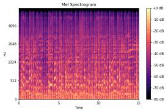

# **Deepfake Audio Detection using Mel Spectrograms and Res2Net Classifier**

  

This repository implements a deep learning model designed to detect AI-generated (TTS) human speech (audio deepfakes). The model utilizes **Mel spectrograms** as input features and is built on a modified **ResNet architecture (\*[Res2Net](https://ieeexplore.ieee.org/abstract/document/9413828))** for binary classification, distinguishing between real and fake audio.

  

## **Table of Contents**

1. [Project Overview](#project-overview)

2. [Dataset](#dataset)

3. [Model & Approach](#model-approach)

4. [Implementation Process](#implementation-process)

5. [Training & Evaluation](#training-evaluation)

6. [Results & Performance](#results-performance)

7. [Installation & Usage](#installation-usage)

  

---

  

## **Project Overview**

  

This project focuses on the detection of deepfake audio by leveraging Mel spectrograms, which provide a visual representation of audio signals. Using a modified **ResNet classifier** built on the ResNet50 architecture, the model is capable of classifying whether an audio sample is real or AI-generated.

  

### **Key Features**

-  **Mel Spectrograms**: Audio is converted into Mel spectrograms for feature extraction.

-  **ResNet Classifier**: Based on ResNet50, the model is fine-tuned to effectively distinguish between real and fake audio.

  

The approach involves:

1. Preprocessing audio files to extract Mel spectrograms. 

2. Training a ResNet-based classifier to detect deepfakes.

3. Evaluating model performance on a curated test dataset.

  

---

  

## **Dataset**

  

-  **Name**: ["In the Wild"](https://deepfake-total.com/in_the_wild) Dataset

-  **Contents**: The dataset consists of both **bona-fide (real)** and **spoofed (fake)** speech recordings, with metadata (`meta.csv`) providing the corresponding labels.

-  **Preprocessing**:

- Audio files are converted into Mel spectrogram images using the `librosa` library.

- Spectrograms are resized to 224x224 for input into the Res2Net model.

  

### **Data Preprocessing Steps**

1. Loaded metadata (`meta.csv`) for file names and labels.

2. Converted audio files to Mel spectrograms (128 Mel bins) with a 16 kHz sampling rate.

3. Resized spectrograms to 224x224 pixels.

4. Split the dataset into training (80%), validation (10%), and test (10%) sets.

  

### **Labeling**:

-  **0**: Bona-fide (real)

-  **1**: Spoofed (fake)

  

---

  

## **Model & Approach**

  

### **Res2Net Classifier**

  

-  **Architecture**: The model uses **ResNet**, which builds upon the ResNet50 architecture with multi-scale feature extraction capabilities, making it ideal for detecting subtle differences in frequency patterns.

-  **Input**: Mel spectrogram images (224x224).

-  **Output**: Binary classification (real vs. fake).

  


  

---

  

## **Implementation Process**

  

### **Preprocessing**

  

1.  **Audio Conversion**: Audio files are loaded and converted to Mel spectrograms using `librosa`.

     


2.  **Dataset Creation**: A custom dataset class (`MelSpectrogramDataset`) is implemented to handle the loading and transformation of spectrogram images.

3.  **Dataset Split**: The dataset is split into training (80%), validation (10%), and test (10%) sets.

  

### **Model Training**

  

-  **Base Model**: ResNet50 architecture, modified for binary classification.

-  **Training Procedure**:

-  **Optimizer**: Adam optimizer with a learning rate of 0.0001.

-  **Loss Function**: Binary cross-entropy loss.

-  **Epochs**: 10 epochs for initial training with accuracy monitored for both training and validation sets.

  

### **Model Code Example**:

  

```python

# Train the model

train_model(model, train_loader, val_loader, criterion, optimizer, epochs=10)

```

  ---

## Training & Evaluation

### Training the Model

  

To begin training, execute the following function to train the model using the specified datasets:

  

```pyhton

train_model(model, train_loader, val_loader, criterion, optimizer, epochs=10)

```

  

### Evaluating Model Performance

  

After training, evaluate the model's performance on the test set using:

```pyhton

evaluate_model(model, test_loader)

```

### Saving the Model

  

Once the model is trained, save it for later use:

```python

torch.save(model.state_dict(), "path_to_save_model.pth")

```

  ---

## Installation & Usage

### Installation

  

To set up the environment and install dependencies, run the following command:

```pyhton

pip install -r requirements.txt

```

### **Usage**

  

1.  **Prepare Data**

    Place the dataset and metadata in the designated directories
    and complete all TODO.
  

2.  **Train the Model**

      Run the provided code to begin model training:

  

    ```python

      train_model(model, train_loader, val_loader, criterion, optimizer, epochs=10)

     ```

---  

## Results & Performance

  

**Test Accuracy**: Approximately 99% on the test set.

  

The model effectively detects deepfake audio and demonstrates promising performance in real-world scenarios.

  
---
### Acknowledgments

  

Special thanks to the creators of "In the Wild" dataset for providing the audio data used in this project.
